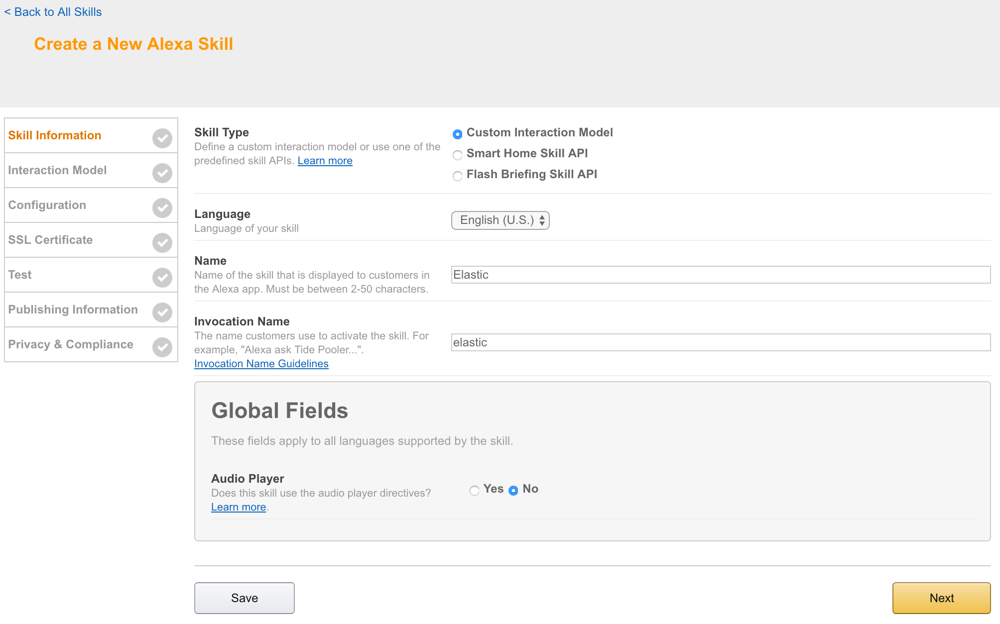
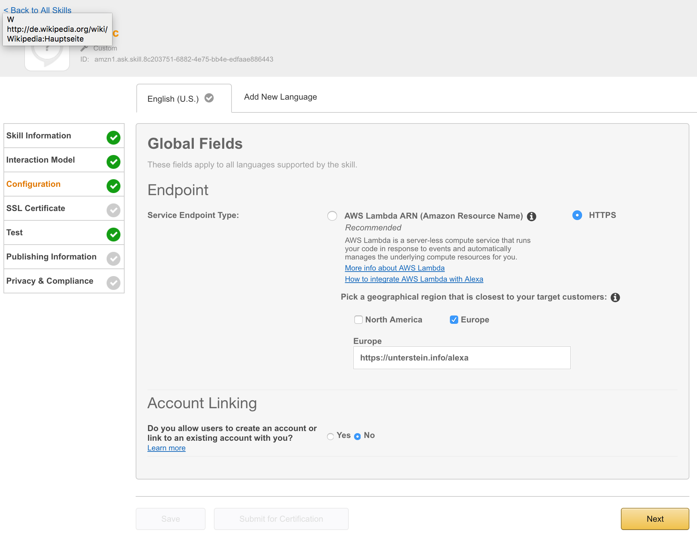
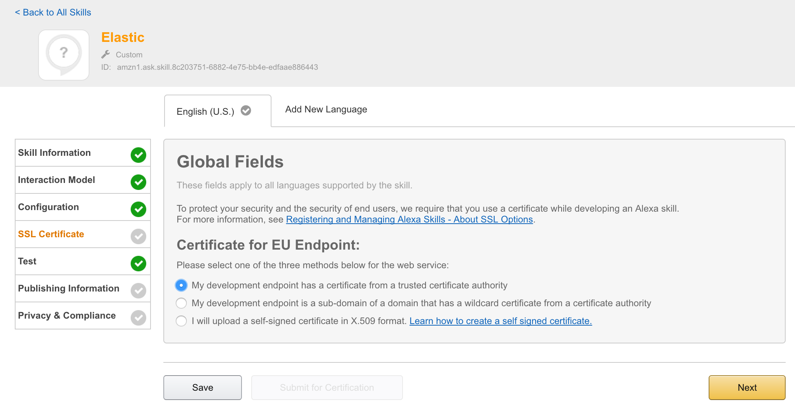
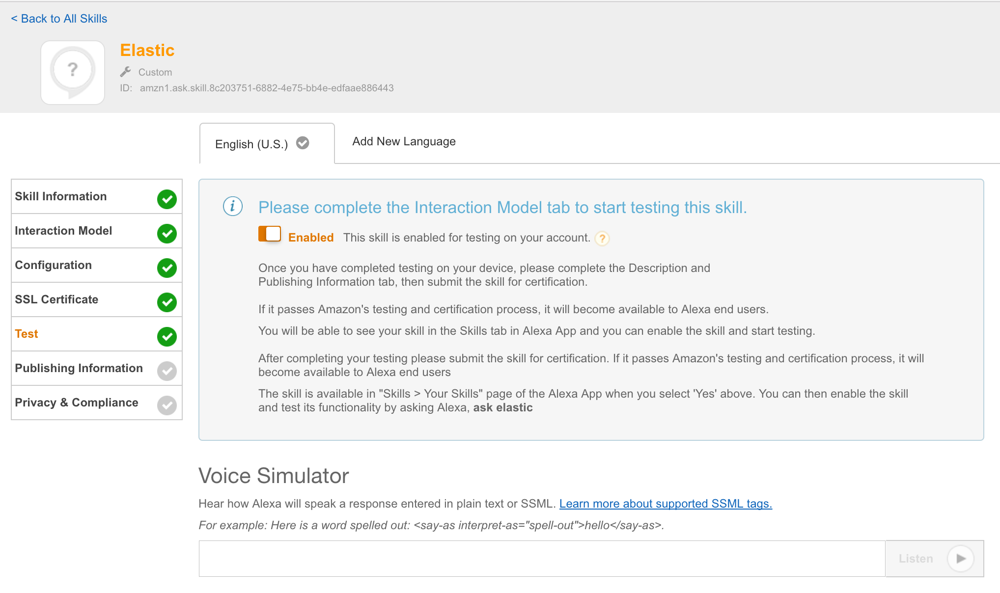

# Elasticsearch Alexa skill
Skill for Amazon echo to enable `Alexa` to talk to [Elasticsearch](https://elastic.io).


## Current possible interaction
Configured `IntentSchema`:

```
ElasticSearch Search {emptyTerm|term} of past {minutes} minutes
ElasticCount Count {emptyTerm|term} of past {minutes} minutes
```

Explanation:

 1. Search term in elasticsearch
 2. Search for term in elasticsearch and count result set

Example:

```
Alexa? Ask Elastic to search error of past five minutes
```

is transformed to skill (intent) and variable configuration (slots):

```
intent=ElasticSearch
slot(term)=error
slot(minutes)=5
```

**Note:** Data type `number` can be translated from `five` to `5` directly.


## Java application called by alexa
Amazon provided a nice SDK and a nice way to interact with alexa. After registering your skill to amazon developer console, your endpoint get called with relevant payload. I decided to use a spring boot application handling these requests. Java code is in `src`, relevant business logic is included in

```
src/main/java/info/unterstein/alexa/elastic/alexa/ElasticSpeechlet.java
```


## Get this app up and running
Currently you need to configure the target ElasticSearch cluster within code. This should be changed to be configured during installing this skill to amazon echo, see section `Option issues`.
But, for now, you need to go to

```
src/main/java/info/unterstein/alexa/elastic/ElasticSpeechlet.java
```

and do something like:

```
  // TODO
  public ElasticSpeechlet.java() {
    client = new ElasticSearchClient("your.elastic.url", 9300, "your.cluster.name");
  }
```

Then you need to package this app and start it somewhere:

```
mvn clean package
# deploy it somewhere with following command
java -jar elastic-alexa-0.0.1-SNAPSHOT.jar --server.port=19002
```

## Walkthrough amazon developer console

### Step 1: Skill information


### Step 2: Interaction model


Text entered:

```
speechAssets/IntentSchema.json
speechAssets/SampleUtterances.txt
```

### Step 3: Configuration


I needed an http endpoint with valid ssl certificate. You can choose between onprem installation or AWS lamba. I decided to deployed the app directly to my server, proxied behind NGINX using the following configuration:

```
server {
        listen 443 ssl;
        server_name unterstein.info;

...

        ssl_certificate      /etc/nginx/ssl/unterstein.info.crt;
        ssl_certificate_key  /etc/nginx/ssl/unterstein.info.key;

...

        location /alexa {
                proxy_pass http://127.0.0.1:19002/alexa;
                proxy_set_header Host $host;
                proxy_set_header X-Real-IP $remote_addr;
                proxy_set_header X-Forwarded-For $proxy_add_x_forwarded_for;
        }
}

```

### Step 4: SSL Certificate


### Step 5: Test


At this point it is possible to enable this skill for all amazon echos, registered to the current amazon account and can be used directly.


## Short demo video
[https://twitter.com/unterstein/status/832302202702196736](https://twitter.com/unterstein/status/832302202702196736)


## Useful reads
- [Alexa Java SDK](https://github.com/amzn/alexa-skills-kit-java)
- [Amazon tutorial](https://developer.amazon.com/blogs/post/TxDJWS16KUPVKO/new-alexa-skills-kit-template-build-a-trivia-skill-in-under-an-hour)
- [Good pictured tutorial](https://www.pluralsight.com/guides/node-js/amazon-alexa-skill-tutorial)
- [Alexa Developer Console](https://developer.amazon.com/alexa)


## Open issues
- Make skill configurable so that each user (amazon account) can configure his own ElasticSearch cluster and credentials during skill installation. Currently all users of this skill would talk to the same ElasticSearch cluster, which is .. not really cool :-/
- => See https://developer.amazon.com/public/solutions/alexa/alexa-skills-kit/docs/linking-an-alexa-user-with-a-user-in-your-system
